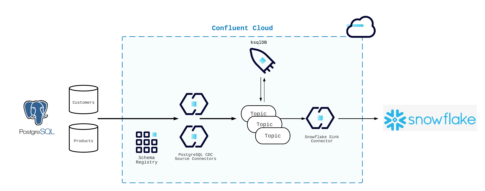

<div align="center" padding=25px>
    
</div>

# <div align="center">Realtime Data Warehousing with Confluent Cloud</div>

## <div align="center">Workshop & Lab Guide</div>

## Background

Data pipelines continue to do the heavy-lifting in data integration. Yet, despite their criticality to the data value stream, they have not evolved fundamentally in the last few decades. Most organizations struggle to capture the enormous potential of their data assets as they’re locked away behind siloed applications and fragmented data estates.
This demo aims to walk you through building streaming data pipelines with Confluent Cloud. You'll learn about

- Confluent’s fully managed PostgresSQL CDC Source connector to stream customer data in real time to Confluent Cloud
- ksqlDB to process and enrich data in real time, generating a unified view of customers’ shopping habits
- Loading the enriched data into Snowflake using the fully managed sink connector for subsequent analytics and reporting

Learn how Confluent’s modern approach to streaming data pipelines breaks down data silos, enables organizations with fully governed real-time data flows, and enriches data in flight. Power real-time operational and analytical use cases in minutes.

---

## Architecture Diagram

This demo utilizes two fully-managed source connectors (PostgreSQL CDC) and one fully-managed sink connector (Snowflake).

<div align="center"> 
  
</div>

---

## Prerequisites

Get a Confluent Cloud account if you don't have one. New accounts start with $400 in credits and do not require a credit card. [Get Started with Confluent Cloud for Free](https://www.confluent.io/confluent-cloud/tryfree/).

You'll need a couple tools that make setup go a lot faster. Install these first.

- `git`
- Docker
- Terraform
  - Special instructions for Apple M1 users are [here](./terraform/running-terraform-on-M1.md)

This repo uses Docker and Terraform to deploy your source databases to a cloud provider. What you need for this tutorial varies with each provider.

- AWS
  - A user account (use a testing environment) with permissions to create resources
  - An API Key and Secret to access the account from Confluent Cloud
- GCP
  - A test project in which you can create resources
  - A user account with a JSON Key file and permission to create resources
- Azure
  - A Service Principal account
  - A SSH key-pair

To sink streaming data to your warehouse, we support Snowflake and Databricks. This repo assumes you can have set up either account and are familiar with the basics of using them.

- Snowflake
  - Your account must reside in the same region as your Confluent Cloud environment
- Databricks _(AWS only)_
  - Your account must reside in the same region as your Confluent Cloud environment
  - You'll need an S3 bucket the Delta Lake Sink Connector can use to stage data (detailed in the link below)
  - Review [Databricks' documentation to ensure proper setup](https://docs.confluent.io/cloud/current/connectors/cc-databricks-delta-lake-sink/databricks-aws-setup.html)

---

## Step-by-Step

### Confluent Cloud Components

1. Clone and enter this repo.

   ```bash
   git clone https://github.com/confluentinc/demo-realtime-data-warehousing
   cd demo-realtime-data-warehousing
   ```

1. Create a file to manage all the values you'll need through the setup.

   ```bash
   cat << EOF > env.sh
   # Confluent Creds
   export BOOTSTRAP_SERVERS="<replace>"
   export KAFKA_KEY="<replace>"
   export KAFKA_SECRET="<replace>"
   export SASL_JAAS_CONFIG="org.apache.kafka.common.security.plain.PlainLoginModule required username='$KAFKA_KEY' password='$KAFKA_SECRET';"
   export SCHEMA_REGISTRY_URL="<replace>"
   export SCHEMA_REGISTRY_KEY="<replace>"
   export SCHEMA_REGISTRY_SECRET="<replace>"
   export SCHEMA_REGISTRY_BASIC_AUTH_USER_INFO="$SCHEMA_REGISTRY_KEY:$SCHEMA_REGISTRY_SECRET"
   export BASIC_AUTH_CREDENTIALS_SOURCE="USER_INFO"

   # AWS Creds for TF
   export AWS_ACCESS_KEY_ID="<replace>"
   export AWS_SECRET_ACCESS_KEY="<replace>"
   export AWS_DEFAULT_REGION="us-east-2" # You can change this, but make sure it's consistent

   # GCP Creds for TF
   export TF_VAR_GCP_PROJECT=""
   export TF_VAR_GCP_CREDENTIALS=""

   # Databricks
   export DATABRICKS_SERVER_HOSTNAME="<replace>"
   export DATABRICKS_HTTP_PATH="<replace>"
   export DATABRICKS_ACCESS_TOKEN="<replace>"
   export DELTA_LAKE_STAGING_BUCKET_NAME="<replace>"

   # Snowflake
   SF_PUB_KEY="<replace>"
   SF_PVT_KEY="<replace>"
   EOF
   ```

   > **Note:** _Run `source env.sh` at any time to update these values in your terminal session. Do NOT commit this file to a GitHub repo._

1. Create a cluster in Confluent Cloud. The Basic cluster type will suffice for this tutorial.

   - [Create a Cluster in Confluent Cloud](https://docs.confluent.io/cloud/current/clusters/create-cluster.html).
   - Select **Cluster overview > Cluster settings**. Paste the value for **Bootstrap server** into your `env.sh` file under `BOOTSTRAP_SERVERS`.

1. [Create an API Key pair](https://docs.confluent.io/cloud/current/access-management/authenticate/api-keys/api-keys.html#ccloud-api-keys) for authenticating to the cluster.

   - Paste the values for the key and secret into `KAFKA_KEY` and `KAFKA_SECRET` in your `env.sh` file.

1. [Enable Schema Registry](https://docs.confluent.io/cloud/current/get-started/schema-registry.html#enable-sr-for-ccloud)

   - Select the **Schema Registry** tab in your environment and locate **API endpoint**. Paste the endpoint value to your `env.sh` file under `SCHEMA_REGISTRY_URL`.

1. [Create an API Key for authenticating to Schema Registry](https://docs.confluent.io/cloud/current/get-started/schema-registry.html#create-an-api-key-for-ccloud-sr).

   - Paste the key and secret into your `env.sh` file under `SCHEMA_REGISTRY_KEY` and `SCHEMA_REGISTRY_SECRET`.

1. [Create a ksqlDB cluster](https://docs.confluent.io/cloud/current/get-started/ksql.html#create-a-ksql-cloud-cluster-in-ccloud).
   - Allow some time for this cluster to provision. This is a good opportunity to stand up and stretch.

---

### Build your cloud infrastructure

The next steps vary slightly for each cloud provider. Expand the appropriate section below for directions. Remember to specify the same region as your sink target!

<details>
    <summary><b>AWS</b></summary>

1. Navigate to the repo's AWS directory.
   ```bash
   cd terraform/aws
   ```
1. Log into your AWS account through command line.

1. Initialize Terraform within the directory.
   ```bash
   terraform init
   ```
1. Create the Terraform plan.
   ```bash
   terraform plan -out=myplan
   ```
1. Apply the plan to create the infrastructure.

   ```bash
   terraform apply myplan
   ```

   > **Note:** _Read the `main.tf` configuration file [to see what will be created](./terraform/aws/main.tf)._

The `terraform apply` command will print the public IP addresses of the host EC2 instances for your Postgres services. You'll need these later to configuring the source connectors.

</details>
<br>

<details>
    <summary><b>GCP</b></summary>

1. Navigate to the GCP directory for Terraform.
   ```bash
   cd terraform/gcp
   ```
1. Initialize Terraform within the directory.
   ```bash
   terraform init
   ```
1. Create the Terraform plan.
   ```bash
   terraform plan --out=myplan
   ```
1. Apply the plan and create the infrastructure.
   ```bash
   terraform apply myplan
   ```
   > **Note:** To see what resources are created by this command, see the [`main.tf` file here](https://github.com/incubate-or-intubate/realtime-datawarehousing/tree/main/terraform/gcp).

The `terraform apply` command will print the public IP addresses for the Postgres instances it creates. You will need these to configure the connectors.

</details>
<br>

<details>
    <summary><b>Azure</b></summary>

1. Navigate to the Azure directory for Terraform.
   ```bash
   cd terraform/azure
   ```
1. Log into Azure account through CLI.

   > **Note** Follow [this](https://developer.hashicorp.com/terraform/tutorials/azure-get-started/azure-build) guide to create the Service Principal to get the ID/Token to use via Terraform.

1. Create a SSH key pair and save it to `~/.ssh/rtdwkey`.

1. Initialize Terraform within the directory.
   ```bash
   terraform init
   ```
1. Create the Terraform plan.
   ```bash
   terraform plan --out=myplan
   ```
1. Apply the plan and create the infrastructure.
   ```bash
   terraform apply myplan
   ```
   > **Note:** To see what resources are created by this command, see the [`main.tf` file here](https://github.com/incubate-or-intubate/realtime-datawarehousing/tree/main/terraform/azure).

The `terraform apply` command will print the public IP addresses for the Postgres instances it creates. You will need these to configure the connectors.

</details>
<br>

---

### Kafka Connectors

1. Create the topics that your source connectors need. Using the Topics menu, configure each onw with **1 partition** only.

   - `postgres.customers.customers`
   - `postgres.customers.demographics`
   - `postgres.products.products`
   - `postgres.products.orders`

1. Once the topics have been created, start by creating the Debezium Postgres CDC Source Connector (for the **customers DB**). Select **Data integration > Connectors** from the left-hand menu, then search for the connector. When you find its tile, select it and configure it with the following settings, then launch it.

   ```
   {
   "name": "PostgresCdcSource_Customers",
   "config": {
      "connector.class": "PostgresCdcSource",
      "name": "PostgresCdcSource_Customers",
      "kafka.auth.mode": "KAFKA_API_KEY",
      "kafka.api.key": "<copy from env file>",
      "kafka.api.secret": "<copy from env file>",
      "database.hostname": "<derived from Terraform output or provided>",
      "database.port": "5432",
      "database.user": "postgres",
      "database.password": "rt-dwh-c0nflu3nt!",
      "database.dbname": "postgres",
      "database.server.name": "postgres",
      "database.sslmode": "disable",
      "table.include.list": "customers.customers, customers.demographics",
      "slot.name": "sequoia",
      "output.data.format": "JSON_SR",
      "after.state.only": "true",
      "output.key.format": "JSON",
      "tasks.max": "1"
      }
   }

   ```

1. Create the Debezium Postgres CDC Source Connector (for the **products DB**) by searching for it as you did above. When you find it, configure it with the following settings, then launch it.
   ```
   {
      "name": "PostgresCdcSource_Products",
      "config": {
      "connector.class": "PostgresCdcSource",
      "name": "PostgresCdcSource_Products",
      "kafka.auth.mode": "KAFKA_API_KEY",
      "kafka.api.key": "<copy from env file>",
      "kafka.api.secret": "<copy from env file>",
      "database.hostname": "<derived from Terraform output or provided>",
      "database.port": "5432",
      "database.user": "postgres",
      "database.password": "rt-dwh-c0nflu3nt!",
      "database.dbname": "postgres",
      "database.server.name": "postgres",
      "database.sslmode": "disable",
      "table.include.list": "products.products, products.orders",
      "slot.name": "redwoods",
      "output.data.format": "JSON_SR",
      "after.state.only": "true",
      "output.key.format": "JSON",
      "tasks.max": "1"
      }
   }
   ```

Launch the connector. Once both are fully provisioned, check for and troubleshoot any failures that occur. Properly configured, each connector begins reading data automatically.

> **Note:** _Only the `products.orders` table emits an ongoing stream of records. The others have their records produced to their topics from an initial snapshot only. After that, they do nothing more. The connector throughput will accordingly drop to zero over time._

<br>

---

### ksqlDB

If all is well, it's time to transform and join your data using ksqlDB. Ensure your topics are receiving records first.

1. Navigate to Confluent Cloud web UI and then go to ksqlDB cluster.

1. Change `auto.offset.reset = earliest`.

1. Use the editor to execute the following queries.

1. Use the following statements to consume `customers` records.

   ```sql
   CREATE STREAM customers_stream WITH (KAFKA_TOPIC='postgres.customers.customers', KEY_FORMAT='JSON', VALUE_FORMAT='JSON_SR');
   ```

1. Verify `customers_stream` stream is populated correctly and then hit **Stop**.

   ```sql
   SELECT * FROM customers_stream EMIT CHANGES;
   ```

1. You can pass `customers_stream` into a ksqlDB table that updates the latest value provided for each field.

   ```sql
    CREATE TABLE customers WITH (KAFKA_TOPIC='customers', KEY_FORMAT='JSON', VALUE_FORMAT='JSON_SR') AS
    SELECT
        id,
        LATEST_BY_OFFSET(first_name) first_name,
        LATEST_BY_OFFSET(last_name) last_name,
        LATEST_BY_OFFSET(email) email,
        LATEST_BY_OFFSET(phone) phone
    FROM customers_stream
    GROUP BY id
    EMIT CHANGES;
   ```

1. Verify the `customers` table is populated correctly.
   ```sql
   SELECT * FROM customers;
   ```
1. Repeat the process above for the `demographics` table.

   ```sql
    CREATE STREAM demographics_stream WITH (KAFKA_TOPIC='postgres.customers.demographics', KEY_FORMAT='JSON', VALUE_FORMAT='JSON_SR');
   ```

1. Verify `demographics_stream` stream is populated correctly and then hit **Stop**.

   ```sql
    SELECT * FROM demographics_stream EMIT CHANGES;
   ```

1. Create a ksqlDB table to present the the latest values by demographics.

   ```sql
    CREATE TABLE demographics WITH (KAFKA_TOPIC='demographics', KEY_FORMAT='JSON',VALUE_FORMAT='JSON_SR') AS
       SELECT
        id,
        LATEST_BY_OFFSET(street_address) street_address,
        LATEST_BY_OFFSET(state) state,
        LATEST_BY_OFFSET(zip_code) zip_code,
        LATEST_BY_OFFSET(country) country,
        LATEST_BY_OFFSET(country_code) country_code
        FROM demographics_stream
        GROUP BY id
    EMIT CHANGES;
   ```

1. Verify the `demographics` table is populated correctly.

   ```sql
   SELECT * FROM demographics;
   ```

1. You can now join `customers` and `demographics` by customer ID to create am up-to-the-second view of each record.

   ```sql
    CREATE TABLE customers_enriched WITH (KAFKA_TOPIC='customers_enriched',KEY_FORMAT='JSON', VALUE_FORMAT='JSON_SR') AS
        SELECT
            c.id id, c.first_name, c.last_name, c.email, c.phone,
            d.street_address, d.state, d.zip_code, d.country, d.country_code
        FROM customers c
        JOIN demographics d ON d.id = c.id
    EMIT CHANGES;
   ```

1. Verify `customers_enriched` stream is populated correctly and then hit **Stop**.

   ```sql
   SELECT * FROM customers_enriched EMIT CHANGES;
   ```

1. Next you will capture your `products` records and convert the record key to a simpler value.

   ```sql
    CREATE STREAM products_composite (
        struct_key STRUCT<product_id VARCHAR> KEY,
        product_id VARCHAR,
        `size` VARCHAR,
        product VARCHAR,
        department VARCHAR,
        price VARCHAR
   ) WITH (KAFKA_TOPIC='postgres.products.products', KEY_FORMAT='JSON', VALUE_FORMAT='JSON_SR', PARTITIONS=1, REPLICAS=3);
   ```

   ```sql
    CREATE STREAM products_rekeyed WITH (
        KAFKA_TOPIC='products_rekeyed',
        KEY_FORMAT='JSON',
        VALUE_FORMAT='JSON_SR'
    ) AS
        SELECT
            product_id,
            `size`,
            product,
            department,
            price
        FROM products_composite
    PARTITION BY product_id
   EMIT CHANGES;
   ```

1. Verify `products_rekeyed` stream is populated correctly and then hit **Stop**.
   ```sql
   SELECT * FROM products_rekeyed EMIT CHANGES;
   ```
1. Create a ksqlDB table to show the most up-to-date values for each `products` record.

   ```sql
    CREATE TABLE products WITH (
    KAFKA_TOPIC='products',
    KEY_FORMAT='JSON',
    VALUE_FORMAT='JSON_SR'
    ) AS
        SELECT
            product_id,
            LATEST_BY_OFFSET(`size`) `size`,
            LATEST_BY_OFFSET(product) product,
            LATEST_BY_OFFSET(department) department,
            LATEST_BY_OFFSET(price) price
        FROM products_rekeyed
        GROUP BY product_id
    EMIT CHANGES;
   ```

1. Verify the `products` table is populated correctly.

   ```sql
   SELECT * FROM products;
   ```

1. Follow the same process using the `orders` data.

   ```sql
    CREATE STREAM orders_composite (
        order_key STRUCT<`order_id` VARCHAR> KEY,
        order_id VARCHAR,
        product_id VARCHAR,
        customer_id VARCHAR
   ) WITH (
        KAFKA_TOPIC='postgres.products.orders',
        KEY_FORMAT='JSON',
        VALUE_FORMAT='JSON_SR'
   );
   ```

   ```sql
    CREATE STREAM orders_rekeyed WITH (
        KAFKA_TOPIC='orders_rekeyed',
        KEY_FORMAT='JSON',
        VALUE_FORMAT='JSON_SR'
    ) AS
        SELECT
            order_id,
            product_id,
            customer_id
        FROM orders_composite
    PARTITION BY order_id
   EMIT CHANGES;
   ```

1. Verify `orders_rekeyed` stream is populated correctly and then hit **Stop**.
   ```sql
   SELECT * FROM orders_rekeyed EMIT CHANGES;
   ```
1. You're now ready to create a ksqlDB stream that joins these tables together to create enriched order data in real time.
   ```sql
    CREATE STREAM orders_enriched WITH (
    KAFKA_TOPIC='orders_enriched',
    KEY_FORMAT='JSON',
    VALUE_FORMAT='JSON_SR'
    ) AS
        SELECT
            o.order_id AS `order_id`,
            p.product_id AS `product_id`,
            p.`size` AS `size`,
            p.product AS `product`,
            p.department AS `department`,
            p.price AS `price`,
            c.id AS `customer_id`,
            c.first_name AS `first_name`,
            c.last_name AS `last_name`,
            c.email AS `email`,
            c.phone AS `phone`,
            c.street_address AS `street_address`,
            c.state AS `state`,
            c.zip_code AS `zip_code`,
            c.country AS `country`,
            c.country_code AS `country_code`
        FROM orders_rekeyed o
            JOIN products p ON o.product_id = p.product_id
            JOIN customers_enriched c ON o.customer_id = c.id
    PARTITION BY o.order_id
    EMIT CHANGES;
   ```
1. Verify `orders_enriched` stream is populated correctly and then hit **Stop**.

   ```sql
   SELECT * FROM orders_enriched EMIT CHANGES;
   ```

   > **Note:** We need a stream to 'hydrate' our data warehouse once the sink connector is set up.

Verify that you have a working ksqlDB topology. You can inspect it by selecting the **Flow** tab in the ksqlDB cluster. Check to see that records are populating the `orders_enriched` kstream.

---

### Data Warehouse Connectors

You're now ready to sink data to your chosen warehouse. Expand the appropriate section and follow the directions to set up your connector.

<details>
    <summary><b>Databricks</b></summary>
    
1. Review the [source documentation](https://docs.confluent.io/cloud/current/connectors/cc-databricks-delta-lake-sink/cc-databricks-delta-lake-sink.html) if you prefer.

1. Locate your JDBC/ODBC details. Select your cluster. Expand the **Advanced** section and select the **JDBC/ODBC** tab. Paste the values for **Server Hostname** and **HTTP Path** to your `env.sh` file under `DATABRICKS_SERVER_HOSTNAME` and `DATABRICKS_HTTP_PATH`.

   > **Note:** If you don't yet have an S3 bucket, AWS Key/secret, or Databricks Access token as described in the Prerequisites, create and/or gather them now.

1. Create your Databricks Delta Lake Sink Connector. Select **Data integration > Connectors** from the left-hand menu and search for the connector. Select its tile and configure it using the following settings.

   | **Property**                      | **Value**                 |
   | --------------------------------- | ------------------------- |
   | Topics                            | `orders_enriched`         |
   | Kafka Cluster Authentication mode | KAFKA_API_KEY             |
   | Kafka API Key                     | _copy from `env.sh` file_ |
   | Kafka API Secret                  | _copy from `env.sh` file_ |
   | Delta Lake Host Name              | _copy from `env.sh` file_ |
   | Delta Lake HTTP Path              | _copy from `env.sh` file_ |
   | Delta Lake Token                  | _from Databricks setup_   |
   | Staging S3 Access Key ID          | _from Databricks setup_   |
   | Staging S3 Secret Access Key      | _from Databricks setup_   |
   | S3 Staging Bucket Name            | _from Databricks setup_   |
   | Tasks                             | 1                         |

1. Launch the connector. Once provisioned correctly, it will write data to a Delta Lake Table automatically. Create the following table in Databricks.

   ```sql
       CREATE TABLE orders_enriched (order_id STRING,
           product_id STRING, size STRING, product STRING, department STRING, price STRING,
           id STRING, first_name STRING, last_name STRING, email STRING, phone STRING,
           street_address STRING, state STRING, zip_code STRING, country STRING, country_code STRING,
           partition INT)
       USING DELTA;
   ```

1. Et voila! Now query yours records
   ```sql
    SELECT * FROM default.orders_enriched;
   ```

Experiment to your heart's desire with the data in Databricks. For example, you could write some queries that combine the data from two tables each source database, such as caclulating total revenue by state.

</details>
<br>

<details>
    <summary><b>Snowflake</b></summary>
    
1. Follow the [source documentation](https://docs.confluent.io/cloud/current/connectors/cc-snowflake-sink.html) for full details if you wish. 
    
1. Create a private/public key pair for authenticating to your Snowflake account. 
    - In a directory outside of your repo, run the following:
    ```
    $ openssl genrsa -out snowflake_key.pem 2048
    $ openssl rsa -in snowflake_key.pem  -pubout -out snowflake_key.pub
    $ export SF_PUB_KEY=`cat snowflake_key.pub | grep -v PUBLIC | tr -d '\r\n'`
    $ export SF_PVT_KEY=`cat snowflake_key.pem | grep -v PUBLIC | tr -d '\r\n'`
    ```
    - Copy the values of each parameter into your `env.sh` file for easy access
    
1. Create a Snowflake user with permissions. Refer to the [source doc](https://docs.confluent.io/cloud/current/connectors/cc-snowflake-sink.html#creating-a-user-and-adding-the-public-key) if you need screenshots for guidance.
    - Login to your Snowflake account and select `Worksheets` from the menu bar.
    - In the upper-corner *of the Worksheet view*, set your role to `SECURITYADMIN`
    - The following steps configure the role `kafka_connector` with full permissions on database `RTDW`:
    ```
    use role securityadmin;
    create user confluent RSA_PUBLIC_KEY=<*SF_PUB_KEY*>
    create role kafka_connector;
    // Grant database and schema privileges:
    grant usage on database RTDW to role kafka_connector;
    grant usage on schema RTDW.PUBLIC to role kafka_connector;
    grant create table on schema RTDW.PUBLIC to role kafka_connector;
    grant create stage on schema RTDW.PUBLIC to role kafka_connector;
    grant create pipe on schema RTDW.PUBLIC to role kafka_connector;

    // Grant this role to the `confluent` user and make it the user's default:
    grant role kafka_connector to user confluent;
    alter user confluent set default_role=kafka_connector;
    ```

1. To review the grants, enter:
   ```
   show grants to role kafka_connector;
   ```
1. Configure the SnowflakeSink connector

   - Review the [connector's limitations](https://docs.confluent.io/cloud/current/connectors/cc-snowflake-sink.html#quick-start)
   - Fill in the values using the following table:

   | **Property**                      | **Value**                 |
   | --------------------------------- | ------------------------- |
   | Topic to read                     | `orders_enriched`         |
   | Input Kafka record value format   | `JSON_SR`                 |
   | Input Kafka record hey format     | `JSON`                    |
   | Kafka cluster authentication mode | `KAFKA_API_KEY`           |
   | Kafka API Key                     | from `env.sh`             |
   | Kafka API Secret                  | from `env.sh`             |
   | Connection URL                    | for Snowflake account     |
   | Connection user name              | `confluent`               |
   | Private key                       | `SF_PVT_KEY` in `env.sh`. |
   | Database name                     | `RTDW`                    |
   | Schema name                       | `PUBLIC`                  |
   | Topic to tables mapping           | `orders_enriched:orders`  |
   | Tasks                             | `1`                       |

1. Once provisioning succeeds, the connector reads the `orders_enriched` topic, creates the Snowflake table `orders`, and starts populating it immediately. It may however take a few minutes for Snowflake to read the records from object storage and create the table.

1. Run the following commands to make your warehouse active and assume the appropriate role. You will then see a few records returned in JSON format.

   ```sql
   use warehouse <replace>;
   use role kafka_connector;
   SELECT record_content FROM rtdw.public.orders limit 100;
   ```

1. You can flatten data in Snowflake if you wish. Use [Snowflake's documentation](https://docs.snowflake.com/en/user-guide/json-basics-tutorial-query.html). You can also query JSON data directly in Snowflake by naming the column and specifying columns of interest. For example:

   ```sql
   SELECT RECORD_CONTENT:email from rtdw.public.orders limit 100;

   ```

</details>

<br>

---

## CONGRATULATIONS

Congratulations on building your streaming data pipelines for realtime data warehousing scenario in Confluent Cloud! Your complete pipeline should resemble the following one.


---

## Cleanup

**Delete everything you provisioned** in this lab to avoid further usage charges. If you want to keep your work but minimize uptime cost, pause your connectors.

### Confluent Cloud resources to remove

- ksqlDB Cluster
- Delta Lake Sink Connector
- Postgres CDC Source Connector
- Mysql CDC Source Connector
- Kafka Cluster

### Terraform

Use `terraform apply -destroy` to clear out your cloud resources

### Databricks and Snowflake

If you created instances of either Databricks and Snowflake solely to run this lab, you can remove them.

---

## Useful Links

Databricks

- [Confluent Cloud Databricks Delta Lake Sink](https://docs.confluent.io/cloud/current/connectors/cc-databricks-delta-lake-sink/cc-databricks-delta-lake-sink.html)
- [Databricks Setup on AWS](https://docs.confluent.io/cloud/current/connectors/cc-databricks-delta-lake-sink/databricks-aws-setup.html)
